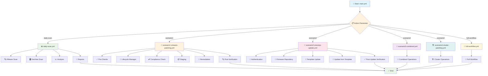
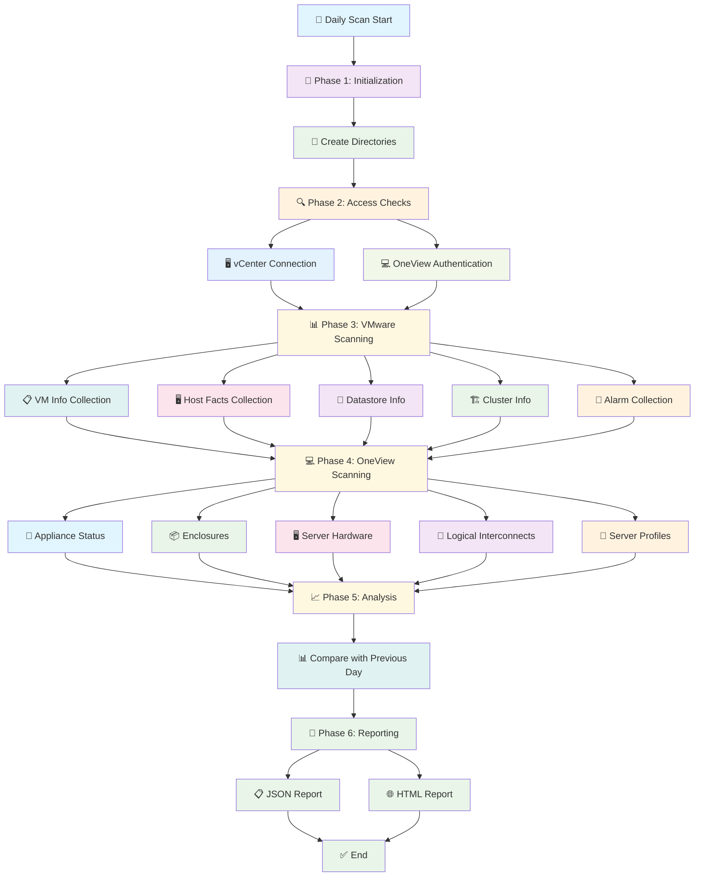
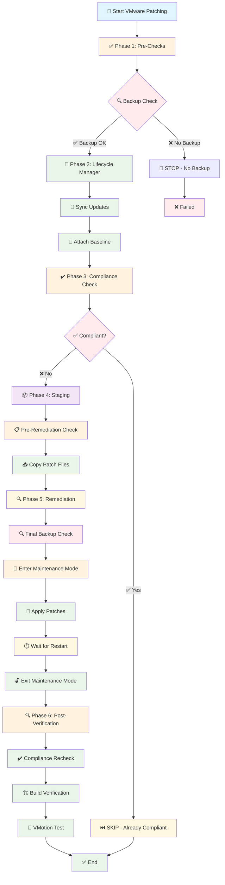
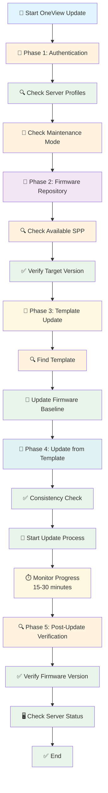
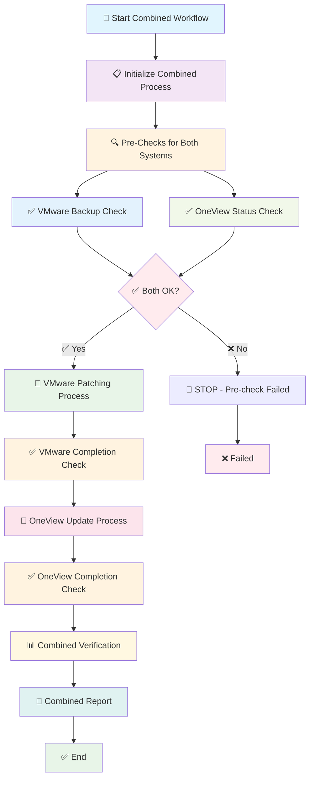
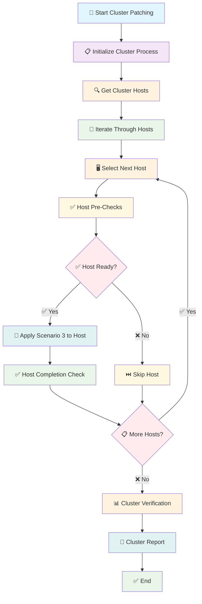
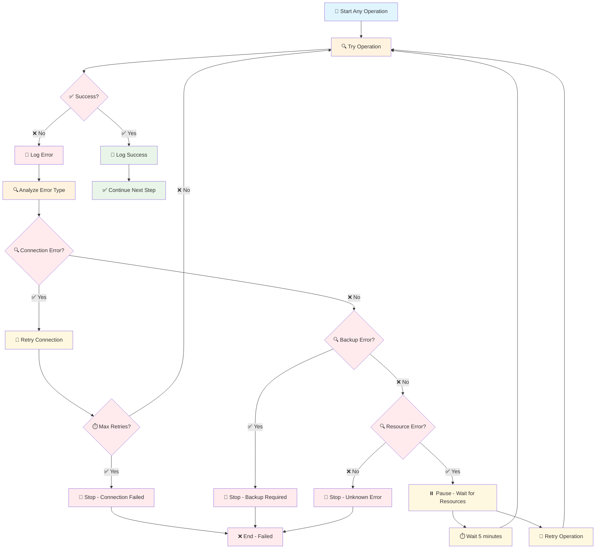
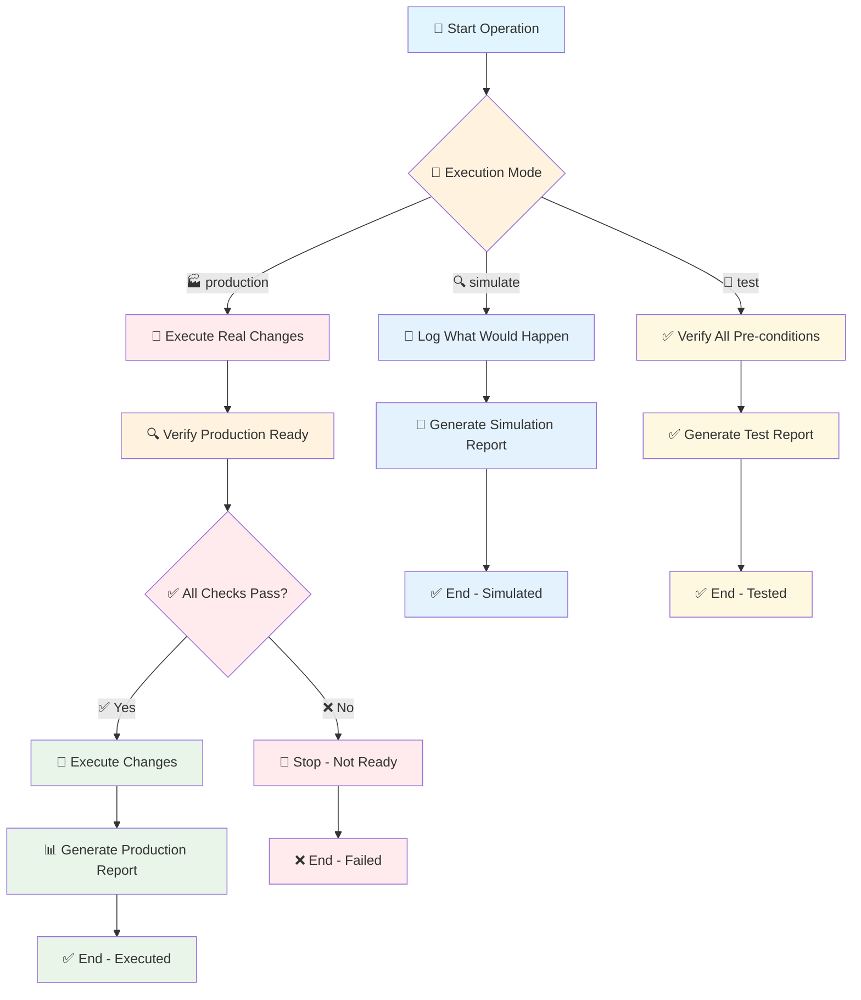
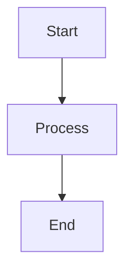

# Mermaid Dijagrami - Ansible Automation

## 📋 Sadržaj

1. [Glavni Orchestrator Flow](#glavni-orchestrator-flow)
2. [Daily Scan Workflow](#daily-scan-workflow)
3. [VMware Patching Phases](#vmware-patching-phases)
4. [OneView Update Process](#oneview-update-process)
5. [Combined Workflow](#combined-workflow)
6. [Error Handling Flow](#error-handling-flow)

---

## 🎯 Glavni Orchestrator Flow



---

## 📊 Daily Scan Workflow

```mermaid
graph LR
    A[🚀 Start Daily Scan] --> B[📝 Initialize Logging]
    B --> C[📁 Create Report Directory]
    C --> D[🔍 Check vCenter Access]
    D --> E[🔍 Check OneView Access]
    E --> F[🖥️ VMware Scanning]
    F --> G[💻 OneView Scanning]
    G --> H[📈 Compare with Previous Day]
    H --> I[📊 Generate Reports]
    I --> J[📄 JSON Report]
    I --> K[🌐 HTML Report]
    J --> L[✅ End]
    K --> L
    
    style A fill:#e1f5fe
    style B fill:#f3e5f5
    style C fill:#e8f5e8
    style D fill:#fff3e0
    style E fill:#fce4ec
    style F fill:#e3f2fd
    style G fill:#f1f8e9
    style H fill:#fff8e1
    style I fill:#e0f2f1
    style J fill:#e8f5e8
    style K fill:#e8f5e8
    style L fill:#e8f5e8
```



### Daily Scan - Detaljna Faza



---

## 🔧 VMware Patching Phases



---

## 🔄 OneView Update Process



---

## 🔀 Combined Workflow (Scenario 3)



---

## 🏗️ Cluster Patching Workflow (Scenario 4)



---

## 🚨 Error Handling Flow



---

## 📊 Execution Modes Flow



---

## 📝 Korišćenje Mermaid Dijagrama

Ovi dijagrami se mogu koristiti u:

1. **Markdown dokumentima** - Većina modernih Markdown editora podržava Mermaid
2. **GitHub/GitLab** - Automatski renderuju Mermaid dijagrame
3. **VS Code** - Sa Mermaid preview ekstenzijom
4. **Online alatima** - mermaid.live, mermaid-js.github.io
5. **Dokumentacionim sistemima** - Confluence, Notion, itd.

### Primer uključivanja u Markdown:

```markdown

```

---

**Verzija:** 1.0  
**Autor:** Ansible Automation Team  
**Datum:** 2024-02-07  
**Jezik:** Srpski (Cirilica)